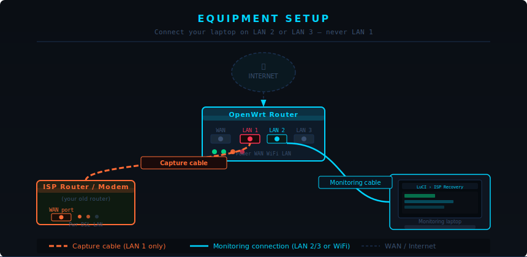
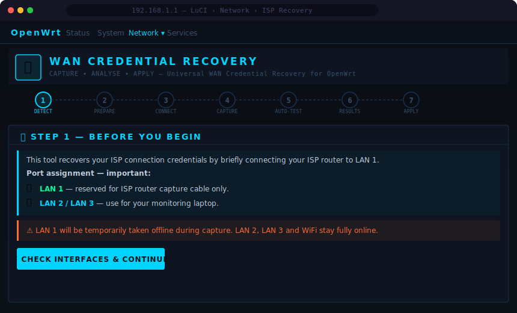
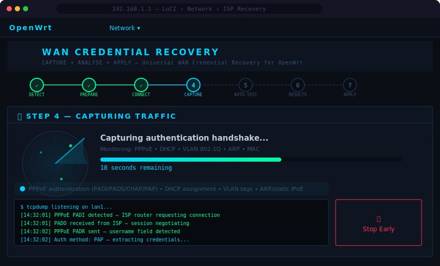
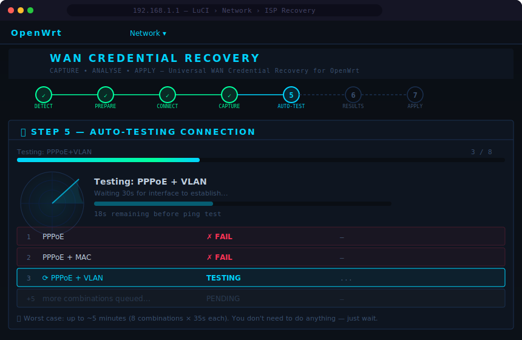
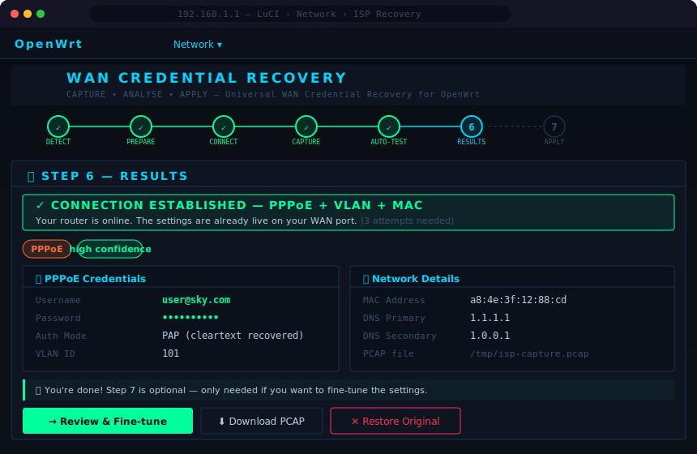

# luci-app-isp-recovery

**WAN Credential Recovery Wizard for OpenWrt**

Automatically recover your ISP connection credentials by briefly connecting your ISP's router to a spare LAN port and capturing its authentication handshake. Detects PPPoE usernames and passwords, DHCP settings, static IP configuration, VLAN tags, and MAC addresses — then lets you apply them directly to your WAN port in one click.

Works with any ISP that uses standard protocols — **Sky, BT, Virgin Media, TalkTalk, Plusnet, Vodafone, EE**, and most others worldwide.

---

## Screenshots

### Physical Setup



> Your monitoring laptop connects on **LAN 2 or LAN 3** (or WiFi). **LAN 1 is reserved exclusively for the ISP router capture cable.**

---

### Step 1 — Welcome & Port Assignment



The wizard explains exactly which port to use and why before anything happens. Checks that `lan1` is present on your router hardware.

---

### Step 4 — Live Packet Capture



A 30-second capture window with live terminal output. Shows the PPPoE handshake being detected in real time. Stop early once you see authentication traffic.

---

### Step 5 — Auto-Test



Automatically tests each detected configuration combination against your real WAN port — PPPoE plain, then with MAC clone, then with VLAN, then all three together. No manual trial and error.

---

### Step 6 — Results



Displays everything recovered: credentials, VLAN ID, MAC address, DNS. If auto-test connected successfully a green banner confirms you're already online.

---

## How It Works

1. Takes **LAN 1 offline** so the ISP router sees a fresh cable connection
2. You plug the **ISP router's WAN port into LAN 1** (reboot it for a clean auth)
3. A **30-second packet capture** starts — catches PPPoE handshake, DHCP offer, ARP, VLAN tags
4. The capture is **analysed** for credentials, IP settings, VLAN ID, and MAC address
5. **Auto-test** tries each combination against your real WAN port (30s per attempt)
6. On success: settings are live. On failure: fields are pre-filled for manual entry

---

## Requirements

- OpenWrt 21.02 or later with LuCI installed
- `tcpdump` and `libpcap` — **installed and removed automatically** by the installer
- A spare LAN port (`lan1`) — use LAN 2 or LAN 3 (or WiFi) for your monitoring device
- Your ISP router powered on with an Ethernet cable

---

## Installation

### Option 1 — git clone (recommended)

SSH into your router, then:

```sh
opkg update && opkg install git git-http
cd /tmp
git clone https://github.com/eddwatts/luci-app-isp-recovery.git
sh /tmp/luci-app-isp-recovery/install.sh
```

---

### Option 2 — wget (no git needed)

```sh
cd /tmp
wget -O luci-isp-recovery.tar.gz \
  https://github.com/eddwatts/luci-app-isp-recovery/archive/refs/heads/main.tar.gz
tar -xzf luci-isp-recovery.tar.gz
sh luci-app-isp-recovery-main/install.sh
```

---

### Option 3 — scp from your PC

Clone the repo on your PC first, then:

```sh
scp -r luci-app-isp-recovery/ root@192.168.1.1:/tmp/
ssh root@192.168.1.1 'sh /tmp/luci-app-isp-recovery/install.sh'
```

---

### Option 4 — OpenWrt SDK

```sh
cp -r luci-app-isp-recovery/ ~/openwrt/package/feeds/luci/
cd ~/openwrt
make menuconfig   # LuCI → Applications → luci-app-isp-recovery
make package/luci-app-isp-recovery/compile
opkg install bin/packages/*/luci/luci-app-isp-recovery_*.ipk
```

---

### After installing

Open LuCI → **Network → ISP Recovery**

Or navigate directly to:
```
http://192.168.1.1/cgi-bin/luci/admin/network/isp_recovery/wizard
```

---

## Uninstall

```sh
sh /tmp/luci-app-isp-recovery/install.sh uninstall
```

Removes all plugin files, and removes `tcpdump`/`libpcap` **only if this tool was the one that installed them**. All capture files are cleared automatically.

If you no longer have the install script:
```sh
wget -O - https://raw.githubusercontent.com/eddwatts/luci-app-isp-recovery/main/install.sh \
  | sh -s uninstall
```

---

## PPPoE Password Recovery Notes

| Auth method | Password recovered? | Notes |
|---|---|---|
| **PAP** | ✅ Yes — fully recovered | Sent in cleartext during handshake |
| **CHAP** | ⚠️ Username only | MD5-hashed — not directly recoverable |
| **MS-CHAPv2** | ⚠️ Username only | Vulnerable to offline dictionary attack |

If CHAP is used: log into the ISP router's admin panel (`192.168.0.1`), contact your ISP to re-provision, or extract the hash from the PCAP for an offline dictionary attack with hashcat.

---

## VLAN Support

Some ISPs (common with UK providers) require a VLAN tag on the WAN interface. The tool detects the 802.1Q tag automatically and the auto-test tries both tagged and untagged variants.

---

## MAC Cloning

Many ISPs register the MAC address of your old router. This tool captures it and offers to clone it onto your WAN port automatically.

---

## Troubleshooting

| Problem | Fix |
|---|---|
| `tcpdump: not found` | `opkg update && opkg install tcpdump` |
| Empty results after capture | Reboot the ISP router before capture so it re-authenticates |
| LAN 1 not found warning | Check port names under Network → Switch in LuCI |
| Auto-test all failed | CHAP password likely needed — fill in manually in Step 7 |
| LuCI shows 404 on wizard | `rm /tmp/luci-indexcache && /etc/init.d/uhttpd restart` |
| Capture looks empty | Increase: edit `CAPTURE_DURATION=30` in `/usr/bin/isp-recover.sh` |

---

## Security Note

The PCAP at `/tmp/isp-capture.pcap` may contain credentials in plaintext. It lives in RAM and does not survive a reboot. Delete immediately after use:

```sh
rm -f /tmp/isp-capture.pcap /tmp/isp-results.json /tmp/isp-autotest.json
```

The uninstall script clears all of these automatically.

---

## File Structure

```
luci-app-isp-recovery/
├── install.sh                              # Installer / uninstaller
├── luci-app-isp-recovery/
│   ├── Makefile                            # OpenWrt SDK package build
│   ├── luasrc/controller/
│   │   └── isp_recovery.lua               # LuCI controller & AJAX endpoints
│   └── root/
│       ├── usr/bin/
│       │   └── isp-recover.sh             # Backend: capture, analyse, autotest, apply
│       └── usr/lib/lua/luci/view/isp-recovery/
│           └── wizard.htm                 # 7-step wizard UI
└── docs/screenshots/                      # Diagrams for this README
```

---

## Contributing

Issues and pull requests welcome at [github.com/eddwatts/luci-app-isp-recovery](https://github.com/eddwatts/luci-app-isp-recovery).

Useful contributions:
- Testing on different OpenWrt hardware and reporting results
- ISP-specific VLAN IDs and auth methods (improves auto-test ordering)
- CHAP/MS-CHAPv2 recovery improvements

---

## License

GPL-2.0
